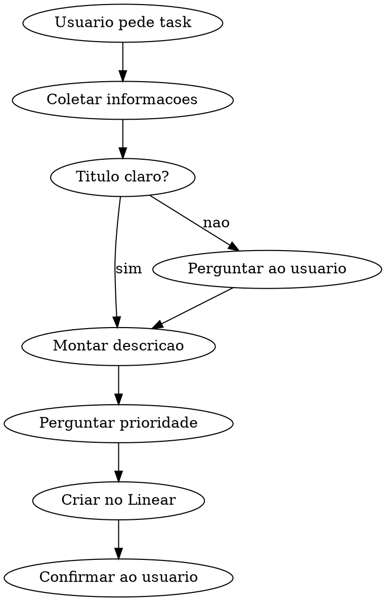

# Criar Task no Linear

Skill para criar tasks padronizadas no Linear, no time **Painel Vagas (PAV)**.

## Pre-requisito: MCP do Linear

Esta skill depende do MCP server `linear-server` estar configurado. Se as ferramentas `mcp__linear-server__*` nao estiverem disponiveis, informe ao usuario:

> O MCP do Linear nao esta configurado. Para usar esta skill, adicione o server `linear-server` nas configuracoes do Claude Code. Consulte a documentacao do MCP para configurar.

## Padrao obrigatorio

Toda task criada deve seguir esta estrutura:

| Campo | Valor |
|---|---|
| **Team** | `Painel Vagas` |
| **State** | `Backlog` |
| **Priority** | `4` (Low) — perguntar ao usuario se deseja alterar |
| **Title** | Titulo objetivo e claro, em portugues |
| **Description** | Markdown com descricao + criterios de aceite |

## Fluxo



1. Extrair ou perguntar: o que a task deve resolver
2. Redigir titulo objetivo (portugues, sem prefixos como "Task:" ou "feat:")
3. Montar descricao em Markdown com secoes obrigatorias (ver template)
4. **Perguntar ao usuario** se quer manter prioridade Low ou alterar (Urgent=1, High=2, Medium=3, Low=4)
5. Criar a issue via `mcp__linear-server__save_issue`
6. Confirmar com o identificador (ex: PAV-42) e link

## Template de descricao

```markdown
## Contexto
[O que motivou essa task e qual problema ela resolve]

## O que deve ser feito
[Descricao clara do trabalho esperado]

## Criterios de aceite
- [ ] [Criterio 1]
- [ ] [Criterio 2]
- [ ] [Criterio 3]
```

## Exemplo de chamada

```
mcp__linear-server__save_issue(
  team: "Painel Vagas",
  title: "Adicionar validacao de email no formulario de registro",
  description: "## Contexto\nO formulario de registro aceita emails invalidos...\n\n## O que deve ser feito\nAdicionar validacao de formato de email...\n\n## Criterios de aceite\n- [ ] Emails invalidos exibem mensagem de erro\n- [ ] Emails validos passam sem bloqueio\n- [ ] Testes unitarios cobrem os cenarios",
  state: "Backlog",
  priority: 4
)
```

## Prioridades disponiveis

| Valor | Nome |
|---|---|
| 1 | Urgente |
| 2 | Alta |
| 3 | Media |
| 4 | Baixa (padrao) |

## Erros comuns

- **Nao perguntar a prioridade** — sempre perguntar antes de criar
- **Titulo vago** — "Corrigir bug" nao serve; use "Corrigir erro de autenticacao ao fazer login com Google"
- **Sem criterios de aceite** — toda task deve ter pelo menos 2 criterios verificaveis
- **Idioma errado** — titulo e descricao devem ser em portugues
